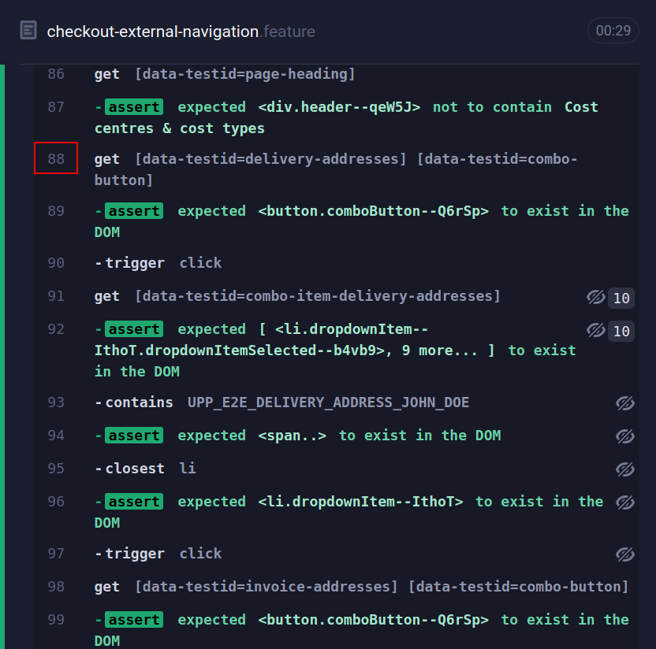
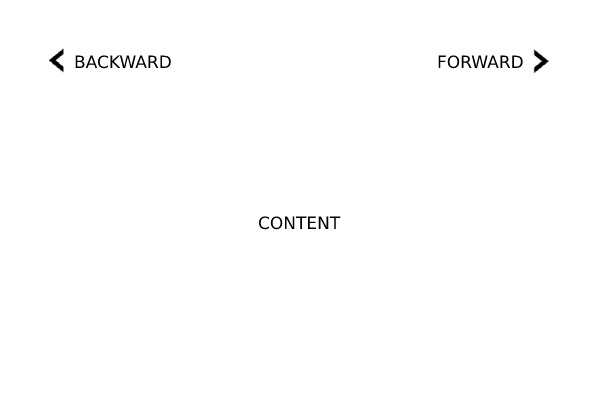

# Cypress Best Practices and Anti-Patterns

> Not yet published.

1. [Checklist](#checklist)
1. [Chain of Commands](#chain-of-commands)
   1. [Flow of Commands](#flow-of-commands)
   1. [Order of Commands](#order-of-commands)
   1. [Embracing Asynchronous Commands](#embracing-asynchronous-commands)
      1. [Avoiding Loops](#avoiding-loops)
         1. [Example](#example)
      1. [Using Recursion](#using-recursion)
1. [Waiting](#waiting)
1. [Assert the Expected State Before Continuing](#assert-the-expected-state-before-continuing)
1. [Selecting and Chaining Correctly](#selecting-and-chaining-correctly)
1. [Intercepted Requests](#intercepted-requests)
1. [Deterministic Over DRY Step Definitions](#deterministic-over-dry-step-definitions)
   1. [Example Scenarios](#example-scenarios)
      1. [Scenario 1](#scenario-1)
      1. [Scenario 2](#scenario-2)
      1. [The Flaky Scenario](#the-flaky-scenario)
      1. [Fixing The Flaky Scenario](#fixing-the-flaky-scenario)
         1. [Scenario 2 Updated](#scenario-2-updated)

## Checklist

- Avoid loops and instead, use recursion with asynchronous commands.
- Do not explicitly wait unless the application has some defined timeout or interval. (e.g. `cy.wait(1000)`)
- Assert that the expected state is reached before continuing.
- Wait for intercepted requests to complete before continuing. (e.g. `cy.wait("@aliasedRequest")`)
- Do not reuse step definitions or helper functions unless you are absolutely sure that the flow is the same.

## Chain of Commands

[Official Docs](https://docs.cypress.io/guides/core-concepts/introduction-to-cypress#Chains-of-Commands)

It's important to understand how the chain of commands and the command queue works in Cypress to be able to avoid flakiness in tests.

### Flow of Commands

There are two ways to continue the flow of commands in Cypress:

1. Continuing in the same chain.

   ```ts
   cy.get("#username").type("username").get("#password").type("password")
   ```

2. Starting a new chain.

   ```ts
   cy.get("#username").type("username")
   // The next statement creates a new chain.
   cy.get("#password").type("password")
   ```

In both of the above code snippets, the order of commands in the command queue is the same.

### Order of Commands

Let's take another example:

```ts
cy.visit("https://localhost:8080/login")

cy.get("#username").type("username")
cy.get("#password").type("password")

cy.get("#submit").click()

cy.findByText("Home Page").should("be.visible")
```

The order in which the commands are executed is the following:

1. `visit("https://localhost:8080/login")`
2. `get("#username")`
3. `type("username")`
4. `get("#password")`
5. `type("password")`
6. `get("#submit")`
7. `click()`
8. `findByText("Home Page")`
9. `should("be.visible")`

This is what Cypress calls the "command queue". Cypress does not run any command immediately but puts it in a queue and all execution happens asynchronously.

The indexes next to commands specified in Cypress runner are also useful in validating the order the commands run in:



### Embracing Asynchronous Commands

Cypress commands are asynchronous as already mentioned. The way it works is:

1. In a test function (i.e. a test spec or a support step definition in Gherkin syntax), commands are enqueued for execution.
2. **Only when the test function is completed, do the commands start to run.**
3. The commands are asynchronously executed based on their order in the queue.
   - Only when one command finishes, does the other continue.

#### Avoiding Loops

Loops can cause unexpected behavior since they are synchronous. A for loop with a limit will technically work since the commands will be added to the queue in order. But it can lead to unexpected behavior so it's better to avoid it.

This is explained well with an example in [this part of Cypress docs](https://docs.cypress.io/guides/core-concepts/introduction-to-cypress#Avoid-loops).

##### Example

Consider a page that generates a random number every second. Let's use the following conditional while loop to test using Cypress when the number 7 appears:

```ts
let isNumber7 = false

while (!isNumber7) {
	cy.get("#number")
		.invoke("text")
		.then(parseInt)
		.then(num => {
			if (num === 7) {
				isNumber7 = true
				cy.log("Number 7 appeared!")
			} else {
				cy.wait(1000)
			}
		})
}
```

This will never actually finish and crash the browser. It's because the test function never finishes and the **command queue never actually starts to execute**. This is mentioned in point "2" of "Embracing Asynchronous Commands" above.

#### Using Recursion

A better way to do this would be to use recursion and keeping the code asynchronous:

```ts
const findNumber7 = () =>
	cy
		.get("#number")
		.invoke("text")
		.then(parseInt)
		.then(num => {
			if (num === 7) {
				cy.log("Number 7 appeared!")
				return
			}

			cy.wait(1000)
			findNumber7()
		})

findNumber7()
```

In this example, **the test function will finish** because the recursive call is done asynchronously in the Cypress chain and the test function isn't blocked.

## Waiting

`cy.wait` is abused a lot to explicitly wait for specific milliseconds. Cypress commands already have a retry mechanism with a timeout, so this is an anti-pattern. You will rarely need to explicitly wait in a Cypress test. Instead, **use assertion to make sure the expected state is reached**.

For example, instead of explicitly waiting like this:

```ts
cy.reload()
cy.wait(500)
cy.get("someButton").click()
```

Use assertion to make sure that the expected element is there:

```ts
cy.reload()
cy.get("someButton").should("be.visible").click()
```

## Assert the Expected State Before Continuing

One of the causes of flaky tests is continuing with the next commands before asserting the expected state. Always make sure that the expected state is reached before moving on in the command queue.

Consider an example where:

1. The user updates the name in settings.
2. The user goes to the profile page to check if the name is updated.

We may write the following code to test this scenario:

```ts
cy.visit("/settings")
cy.get("#nameInput").type("Updated Name")
cy.get("#updateSettingsButton").click()

cy.visit("/profile")
cy.get("#name").should("have.text", "Updated Name")
```

This can cause flakiness because after clicking the `#updateSettingsButton`, it could happen that the frontend was in the middle of some processing and the request did not complete resulting in the name not being updated.

To fix this, we just need to assert that the update was completed before continuing:

```ts
cy.visit("/settings")
cy.get("#nameInput").type("Updated Name")
cy.get("#updateSettingsButton").click()
// Making sure that the settings are successfully updated before moving on.
cy.get("#messageBox").should("have.text", "Settings updated")

cy.visit("/profile")
cy.get("#name").should("have.text", "Updated Name")
```

## Selecting and Chaining Correctly

When a command or assertion fails, Cypress only retries the command previous to that.

So if you have a command chain like this:

```ts
cy.get("parentElement").find("childElement").should("contain.text", "Hello World")
```

If the `should` fails in this case, Cypress will only retry the `find` command. So if the `parentElement` has re-rendered or changed, it may lead to a failure.

These kinds of commands tend to pass locally but can cause flaky behavior in the CI.

To fix this, you could either:

1. Have an assert for the `parentElement` to make sure it is at a state where it wouldn't change again.

   ```ts
   cy.get("parentElement")
   	.should("contain.text", "Expected state reached. No changes to parent after this.")
   	.find("childElement")
   	.should("contain.text", "Hello World")
   ```

2. Or use a single command to reach the child element.

   ```ts
   cy.get("parentElement childElement").should("contain.text", "Hello World")
   ```

There are other combinations that can lead to flaky tests. Just **be on the lookout to make sure that the expected state is reached before moving on in the command chain**.

## Intercepted Requests

[Official Docs](https://docs.cypress.io/api/commands/wait#Alias)

An intercepted request should be awaited before moving on in the command queue. Otherwise, the tests will move on before the response is received which may cause flakiness in tests.

Responses can be awaited by aliasing an intercept command and waiting for its response.

```ts
cy.intercept("/graph/v1").as("graphQlRequest")
cy.get("buttonThatSendsRequest").click()
cy.wait("@graphQlRequest")
cy.get("someElement").should("contain.text", "Expected state")
```

## Deterministic Over DRY Step Definitions

> **NOTE:** Step definitions here refer to [step definitions in Gherkin sytax](https://cucumber.io/docs/cucumber/step-definitions/). This pattern also holds true for any helper functions used across multiple tests written to avoid duplicate code.

Prefer deterministic over DRY (Don't Repeat Yourself) step definitions. Avoid using the same step definitions across multiple scenarios **unless you are absolutely sure that the flow is exactly the same**.

Trying to write reusable code for step definitions can lead to flaky tests since you will need to have some conditions to accommodate the differences between the repeated step definitions.

### Example Scenarios

Let's suppose we have an application in which we can navigate back and forth.



Imagine these two scenarios with a common step definition for clicking the back button:

#### Scenario 1

```gherkin
Scenario: User can go back
  Given user is on the current page
  # Common Step
  When the user clicks the back button
  Then the user is on the previous page
```

#### Scenario 2

```gherkin
Scenario: User can go back and forward again
  Given user is on the current page
  # Common Step
  When the user clicks the back button
  And the user clicks the forward button
  Then the user should be on the current page
```

The code for clicking the back button looks like this:

```ts
When("the user clicks the back button", () => {
	cy.get("#backButton").click()
})
```

#### The Flaky Scenario

In these two scenarios, **"Scenario 2" will be flaky**. That's because **we go back to the previous page in "Scenario 2" but never assert that we are on the previous page**.

What can happen is:

1. We click the back button.
2. We still haven't reached the previous page and are on the current page but we click the forward button.
   - This will happen quite frequently in an SPA with a JavaScript router if the click doesn't immediately take effect.
3. We end up on the next page instead of the current page.

#### Fixing The Flaky Scenario

To fix this, instead of reusing the same step definition, we create a new one:

##### Scenario 2 Updated

```gherkin
Scenario: User can go back and forward again
  Given user is on the current page
  # Updated Step
  When the user goes to the previous page
  And the user clicks the forward button
  Then the user should be on the current page
```

The code for going to the previous page looks like this:

```ts
When("the user goes to the previous page", () => {
	cy.get("#backButton").click()
	// Assertion to make sure we are on the previous page.
	cy.findByText("Previous Page Content").should("be.visible")
})
```

This way, we move on in the command queue to **click the forward button only after making sure we are on the previous page**.
