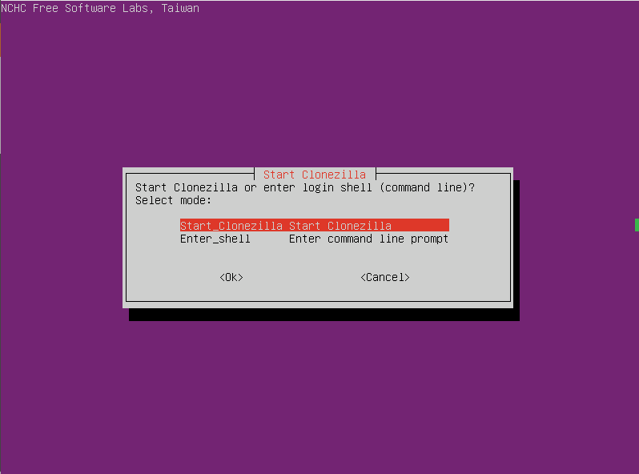

# Migrating Linux from a Virtual Machine to a Physical Machine

> Published at [Unite Blog](https://support.unite.eu/en_GB/blog/migrating-linux-from-a-virtual-machine-to-a-physical-machine).

## Table Of Contents

<!-- toc -->
- [Table Of Contents](#table-of-contents)
- [Background](#background)
- [Requirements](#requirements)
- [Migration](#migration)
  - [Create Backup](#create-backup)
    - [Boot To Clonezilla On The Virtual Machine](#boot-to-clonezilla-on-the-virtual-machine)
    - [Create Backup Image](#create-backup-image)
  - [Restore Backup](#restore-backup)
    - [Boot To Clonezilla On The Target Machine](#boot-to-clonezilla-on-the-target-machine)
    - [Restore Backup Image](#restore-backup-image)
    - [Fixing Boot After Restoring Partition Using boot-repair-disk](#fixing-boot-after-restoring-partition-using-boot-repair-disk)

<!-- tocstop -->

## Background

When I joined Mercateo as a remote developer, I didn't get the office laptop in time and for certain reasons the delivery was delayed to a month. In the meantime, I set up a virtual machine with Ubuntu on my personal device so I could onboard and start the work. When the device arrived after the prolonged wait, I had a lot of things set up on the virtual machine which I would have needed to set up again on the new physical device and that would have taken multiple days. That's where the idea of migrating the virtual machine to the physical machine came. This blog explains the process I used to migrate my fully set up virtual machine to my new office laptop.

## Requirements

- [**Rufus**](https://rufus.ie/) (if you are on Windows) or [**unetbootin**](https://unetbootin.github.io/linux_download.html) (if you are on Linux) for creating bootable USB drive.
- [**Clonezilla**](https://clonezilla.org/downloads.php)
  - Handles the partition sizes automatically — super cool.
- [**boot-repair-disk**](https://sourceforge.net/projects/boot-repair-cd/files/)
  - This is needed if you want to clone only a single partition and not the entire disk.
- A primary USB storage device for booting **Clonezilla** and **boot-repair-disk** on the target machine.
- A secondary USB storage device (a stick or an external hard drive) to store backup of the virtual machine. The storage size depends on the size of your virtual machine.

**Note:** We will be using VMWare Workstation for backup of the virtual machine.

## Migration

### Create Backup

The backup image will be created from the virtual machine. Nothing has to be done on the target machine for this.

#### Boot To Clonezilla On The Virtual Machine

1. Setup **Clonezilla** for boot. Go to the settings of your virtual machine. Under "_Hardware > CD/DVD (SATA)_", enable "_Connect at power on_", choose the "_Connection_" as "_Use ISO image file_" and specify the path to the **Clonezilla** iso file.  
   
1. Start the virtual machine and on the boot screen press "_Escape_" to open the boot menu and boot to CD/DVD.
1. After booting to **Clonezilla**, select your preferred language and then choose "_Start Clonezilla_".  
   

#### Create Backup Image

1. Once in **Clonezilla**, choose "_device-image_" to work with disks or partitions using images.  
   
1. On the next screen, choose "_local_dev_".
1. Connect the secondary USB storage device on which you want to save the backup. Note that the size of this device has to be large so the entire virtual machine setup can be cloned and saved. After you have connected the device and can see it on the screen, press Ctrl-C to move to the next step.  
   
1. On the next screen, select the device you want to save the backup in.  
   
1. Now choose "_no-fsck_" to skip any file system check before creating backup. You can also choose "_fsck_" if you want to check and repair the file system.  
   
1. Now choose the directory you want to save the backup in and select "_Done_". After that press Enter to continue to the next step.
1. On the next screen, choose "_Beginner_" to create the backup with a simple beginner level interface.  
   
1. On the next screen you can either choose "_savedisk_" or "_saveparts_".
   - **savedisk**: The entire disk including all partitions on the virtual machine will be cloned. The downside to this is that any data on the target machine (where you will restore the backup) will be lost because the disk will be formatted including all partitions. However, the process will be smoother.
   - **saveparts**: A single partition on the virtual machine will be cloned. Since we are migrating the operating system, this will be the partition containing the OS. The downside to this is that it will require repairing the boot of target machine after restore using **boot-repair-disk**.  
     _I will choose "saveparts" since I only want to restore the partition and keep other data on the target disk._  
     
1. After choosing the save option, specify the name for the backup image and choose "_Ok_".
1. If you chose the "_saveparts_" option, you will need to specify the partition in the next step. Choose the partition you want to clone (this should be the partition containing the OS).  
   
1. Choose either "_zip_" or "_z9p_" for the compression option dependending on your preference.
1. Choose "_sfsck_" to skip checking source file system.
1. On the next step, choose "_Yes, check the saved image_" to make sure that the saved image is correct and can be restored.  
   
1. Now choose either "_senc_" (not encrypt image) or "_enc_" (encrypt image) based on your preference.
1. Choose the action you want to perform when the backup is finished.
1. Now follow the commandline instructions to create the backup. The image creation process will now start. Note that the process will take some time depending on the size of the disk/partition being cloned.

### Restore Backup

#### Boot To Clonezilla On The Target Machine

1. Using Rufus or unetbootin, make the primary USB drive bootable for **Clonezilla** with the downloaded **Clonezilla** iso.
1. Connect the primary USB device with bootable **Clonezilla** and boot to **Clonezilla** on the target machine.

#### Restore Backup Image

1. Follow the same steps as [backup](#create-backup-image) upto step 8.
   1. Once in **Clonezilla**, choose "_device-image_".
   1. On the next step, choose "_local_dev_".
   1. Connect the secondary USB storage device from which you want to restore the backup.
   1. On the next screen, select the device you want to restore the backup from.
   1. Now choose "_no-fsck_" to skip any file system check before restoring backup. You can also choose "_fsck_" if you want to check and repair the file system.
   1. Now choose the directory you have the backup in. This should be the directory containing folder with the name you specified for the backup. **Clonezilla** will recognize that the directory is a **Clonezilla** image. Choose "_Done_" to move to the next step.
   1. On the next screen, choose "_Beginner_".
1. On this step, you will see the same backup and restore options as in the backup process.
   - Choose "_restoredisk_" if you chose "_savedisk_" in the backup process.
   - Choose "_restoreparts_" if you chose "_saveparts_" in the backup process.  
     _Note that we will need to repair the partition after restore using **boot-repair-disk**._
1. Now you will be prompted to select the image you want to restore. Select the image we created in the backup process.
1. On the next step, choose the partition of the virtual machine you want to restore. This is the same OS partition we made the backup of. If you chose the "_restoredisk_" option, you might see different options. Just follow the on screen instructions.  
   
1. After that, you will need to choose the target partition that needs to be overwritten with the backup of the partition you created. Note that it has to have the size equal to or greater than the backup partition. If not, use some partition tool to increase the target partition size.  
   
1. On the next step, if you want to check the image restorability before restoring, choose "_Yes, check image before restoring_" but this should be unnecessary because we chose to check the backup image when making the backup.  
   
1. Now choose the action to perform when the restore has finished. Start the restore by following the commandline instructions.
1. Note that the restore could fail because the secondary USB device containing the backup might get disconnected. If that happens, just let **Clonezilla** revert the changes and try again until the restore succeeds. I had to try 5-6 times because my exernal hard drive kept getting disconnected. If an error occurs, make sure to check the error messages to identify if there is some other problem. The error messages are verbose enough.
1. If you chose the "_restoredisk_" option, it should be safe to restart the system and the system should be able to boot to the OS.

#### Fixing Boot After Restoring Partition Using boot-repair-disk

If you chose "_saveparts_" for backup and "_restoreparts_" for restore and restarted the system, you will get boot errors and won't be able to boot to the system. Worry not, this can be fixed. Don't try anything else and just use **boot-repair-disk**.

1. Using Rufus or unetbootin, make the primary USB drive bootable for **boot-repair-disk** with the downloaded **boot-repair-disk** iso.
1. Connect the primary USB device with bootable **boot-repair-disk** and boot to **boot-repair-disk** on the target machine. **boot-repair-disk** has a user interface so it's easy to follow.
1. After booting to **boot-repair-disk**, connect the device to internet before doing anything else.
1. After that, simply choose "_Recommended repair_", follow the on-screen steps and let **boot-repair-disk** do its magic.  
   
1. After the repair is complete, you should be able to boot into the restored partition.

Hola! The migration is complete. Hope this guide helped you.
